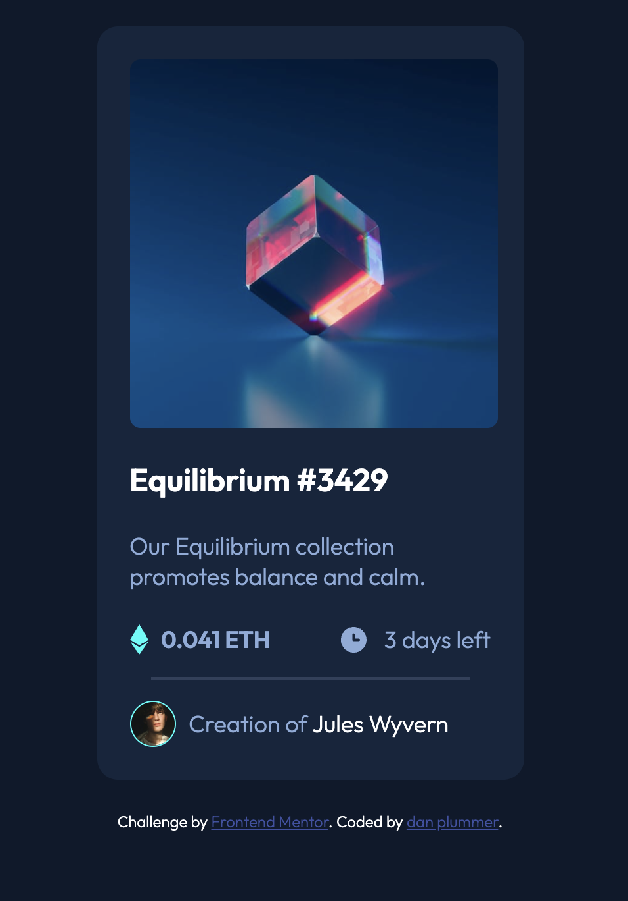

# Frontend Mentor - NFT preview card component solution

This is a solution to the [NFT preview card component challenge on Frontend Mentor](https://www.frontendmentor.io/challenges/nft-preview-card-component-SbdUL_w0U). Frontend Mentor challenges help you improve your coding skills by building realistic projects. 

## Table of contents

- [Overview](#overview)
  - [The challenge](#the-challenge)
  - [Screenshot](#screenshot)
  - [Links](#links)
- [My process](#my-process)
  - [Built with](#built-with)
  - [What I learned](#what-i-learned)
- [Acknowledgments](#acknowledgments)

## Overview

### The challenge

Users should be able to:

- View the optimal layout depending on their device's screen size
- See hover states for interactive elements

### Screenshot

### Links

- Solution URL: [Add solution URL here](https://www.frontendmentor.io/solutions/nft-starter-challenge-basic-html-and-css-jJR5F1Q2G)

- Live Site URL: [Add live site URL here](https://daniielrp.github.io/nft-starter-challenge/)

## My process
Still extremely new, so looking at others code, playing about with CSS to see what various chnages and elements do. Using figma to help with spacing and sizing.

### Built with

- html
- css
- VS code
- Figma

### What I learned

* Mouse-over hover states on images to get one to overlay another
* Extremely basic flexbox to get the icons/price/time showing inline

## Acknowledgments

Used the solution from [blaqbox-prime](https://www.frontendmentor.io/profile/blaqbox-prime) as a starting point, helped out with some of the flex stuff. 
